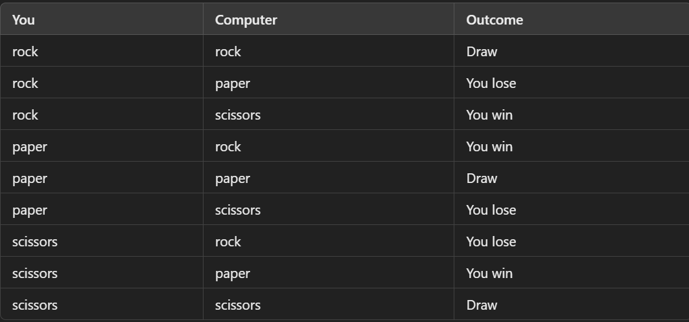

# Rock-Paper-Scissors-Game

Console based game made with Python.

## Project Goals ⚽
A simple game project to practice Python skills and simulate the game "Rock Paper Scissors".

## Solution 🤔
A player enters an input: "r", "p" or "s" each representing "Rock", "Paper" and "Scissors". Then the computer chooses a random
value as well. At the end both values are compared and the possible outcomes are: Win, Lose, Draw as shown in the
following table:

## Contacts ☎
If you have any suggestions, problems with the code, or just want to reach out to me,
do not hesitate to DM me on any social media. I will be happy to answer.